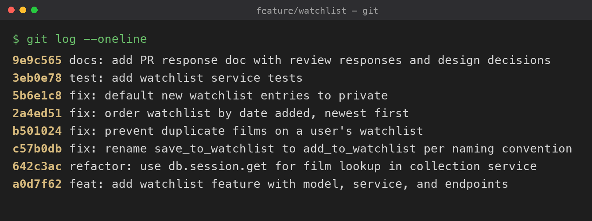

# PR Response Doc — CineLog Watchlist Feature

## AI Usage
<!-- Review and edit this to accurately reflect your own use before submitting. -->
- **Orientation:** Used AI to summarize `models.py`, `collection_service.py`, and `test_collection.py` and to explain the branch topology (feature/watchlist vs. the UUID refactor on main) before reading the review comments.
- **Comment 2 (deduplication):** Asked AI to explain *what* the `add_to_collection` dedup check does and what it returns on a duplicate, rather than to write the code; the check in `add_to_watchlist()` follows that pattern.
- **Comments 4 & 5 (design decisions):** Drafted my positions, then used AI as a devil's advocate to surface counterarguments and un-acknowledged tradeoffs (see stress-test notes below). Revised where the counterargument was real; the reasoning below is in my own voice.
- **Stress-test results:**
  - _Comment 4:_ <!-- what the AI pushed back with, and what you changed (or why you held your position) -->
  - _Comment 5:_ <!-- same -->

## Commit History
Clean, linear history — eight single-purpose commits with Conventional Commits messages (`feat`/`fix`/`refactor`/`test`/`docs`) and no merge commits:



```text
$ git log --oneline
9e9c565 docs: add PR response doc with review responses and design decisions
3eb0e78 test: add watchlist service tests
5b6e1c8 fix: default new watchlist entries to private
2a4ed51 fix: order watchlist by date added, newest first
b501024 fix: prevent duplicate films on a user's watchlist
c57b0db fix: rename save_to_watchlist to add_to_watchlist per naming convention
642c3ac refactor: use db.session.get for film lookup in collection service
a0d7f62 feat: add watchlist feature with model, service, and endpoints
```

## Comment 1 — Rename
**What I did:** Renamed `save_to_watchlist()` to `add_to_watchlist()` in `services/watchlist_service.py` to match the project's `verb_to_noun` naming convention (`add_to_collection`, `remove_from_collection`). Committed on its own as a `fix:` commit.
**Where I looked for call sites:** Ran a project-wide search `grep -rn "save_to_watchlist" . --include="*.py"` rather than trusting memory. It surfaced exactly one usage outside the definition — in `routes/watchlist/watchlist.py`, appearing twice: the `from services.watchlist_service import ...` line and the call inside `add_film()`. Updated both.
**How I verified:** Re-ran the search afterward: `grep -rn "save_to_watchlist"` returns nothing, and `grep -rn "add_to_watchlist"` shows only the definition plus the two updated usages. Full test suite passes.

## Comment 2 — Deduplication
**What I did:** Added an `AlreadyInWatchlistError` exception in `services/watchlist_service.py` (kept with the watchlist service, mirroring how `collection_service.py` defines its own `AlreadyInCollectionError`). Inside `add_to_watchlist()`, after the `FilmNotFoundError` check and *before* `db.session.add(...)`, I query for an existing `WatchlistEntry` filtered on both `user_id` and `film_id`, take `.first()`, and raise `AlreadyInWatchlistError` if a row is found. This follows the pattern in `add_to_collection()`. Deduplication is enforced at the service layer only — I did not add a DB `UniqueConstraint`, matching the pattern the reviewer pointed to. Committed as its own `fix:` commit, separate from the rename.
**How I verified the deduplication logic works:** Added `test_add_to_watchlist_duplicate_raises`, modeled on `test_add_to_collection_duplicate_raises`. It adds the same film twice, asserts the second call raises `AlreadyInWatchlistError` via `pytest.raises`, and — the key check — asserts `WatchlistEntry.query.filter_by(user_id, film_id).count() == 1`, proving no duplicate row was ever inserted.

## Comment 3 — Missing test
**What I did:** Created `tests/test_watchlist.py` following the fixture and assertion structure of `test_collection.py`. Added `test_add_to_watchlist_nonexistent_film_raises` (the equivalent of `test_add_to_collection_nonexistent_film_raises`), which asserts `add_to_watchlist()` raises `FilmNotFoundError` for a `film_id` that doesn't exist, using a UUID that isn't in the database (`"00000000-0000-0000-0000-000000000000"`) to match `test_collection.py`. The file also covers the happy path, deduplication, the private default, and newest-first ordering. Committed as a `test:` commit.
**How I verified:** `pytest tests/test_watchlist.py -v` and `pytest tests/ -v` both pass — the whole suite is green (9 tests), so nothing else broke.

## Comment 4 — Default visibility
**My position:** New watchlists should be **private by default** (`public=False`). I changed the model default in its own `fix:` commit rather than keep `public=True`, and this is a deliberate decision, not an inherited one.

**Reasoning:** A watchlist is a record of *intent* — films a user is curious about but hasn't watched yet. That's more revealing than a collection of films they've already watched and consciously rated: intent exposes aspiration, mood, and unfiltered curiosity (the film someone adds at 2am and might feel self-conscious about). I'm optimizing for the large majority of users who never open the visibility setting at all. A default is consent-by-omission, so the default should be the choice a user would pick if they stopped to think — and for a "things I might watch" list, that's "not public until I say so." Enthusiasts who *want* a public, shareable list lose nothing: it's a single opt-in toggle. The asymmetry is the deciding factor — the cost of the wrong default toward public (unwanted exposure, and it's already been broadcast by the time they notice) is irreversible and trust-eroding, while the cost of the wrong default toward private (a list that's private when the user would have shared it) is fully recoverable with one tap.

**Tradeoff acknowledged:** CineLog is a *community* app, and public watchlists are what feed shared discovery and recommendation — the network effects that make the platform valuable. Private-by-default means a thinner public discovery graph out of the box and less social surface early on. I'm accepting that cost because it's recoverable through good opt-in UX (a prominent "share this list" affordance surfaced while users build a watchlist), whereas a privacy default that over-shares is not. If adoption data later showed sharing was too low, the right lever would be better opt-in prompts, not a more exposing default.

## Comment 5 — Sort order
**My position:** Implement the maintainer's preference — sort by **date added, newest first** (`WatchlistEntry.date_added.desc()`), in its own `fix:` commit. I agree with the reviewer, and I have an additional reason beyond just deferring to them.

**Reasoning:** A watchlist is a *queue of intent*, not a reference catalog. The primary task a user brings to it is "what should I watch next?" — a browsing/deciding task — not "is title X on my list?", which is a lookup task. Newest-first optimizes for the primary task: the film someone just added is the one freshest in their mind and most likely what prompted them to open the app. Alphabetical order optimizes for lookup, but pins the most useful item (the latest add) to an arbitrary position based on its title's first letter. It also gives app-wide consistency: `get_collection()` already sorts `date_added.desc()`, so a user's collection and watchlist now behave identically — one mental model, no surprise.

**Engagement with reviewer's point:** The reviewer said "most users want to see what they added recently," and I think that's right — but I want to name the case *for* alphabetical too, so this is a decision and not just agreement. Alphabetical genuinely wins for one scenario: a long, stable list where the user already knows the title they're hunting for. My judgment is that this is the *secondary* watchlist task, and the real answer for users who hit it at scale is a user-selectable sort (e.g. `GET /watchlist/<id>?sort=title`) layered on top — with date-added as the default. That's out of scope for this PR, but it's the reason I'm comfortable making date-added the default rather than a compromise: it serves the common case now without foreclosing the lookup case later.

## Comment 6 — Rebase
**What conflicted:** The watchlist branch was opened *before* the refactor on `main` that migrated film IDs from integer to UUID (`refactor: migrate film IDs from integer to UUID`). That refactor changed `Film.id` and `CollectionEntry.film_id` to `String(36)` and, on `main`, removed the `WatchlistEntry` class entirely (it lives only on the feature branch). Rebasing the branch onto `main` therefore conflicted in `models.py`: my watchlist code still assumed an integer `film_id`, and `main`'s side no longer contained a `WatchlistEntry` class to reconcile against.
**How I resolved it:** I rebased onto `main` (not merged — no merge commits) and re-introduced `WatchlistEntry` on top of `main`'s UUID models, defining `film_id` as `db.Column(db.String(36), db.ForeignKey("film.id"), ...)` so it matches the migrated `Film.id` and `CollectionEntry.film_id`. All watchlist code is now UUID-consistent: the model, the `add_to_watchlist` docstring, and the tests all use UUID string IDs. After resolving, I cleaned up the branch history (Milestone 4) so each commit is a single logical change with a Conventional Commits message.
**How I verified no conflict remains:** `grep -n "<<<<<<<\|=======\|>>>>>>>" models.py` returns nothing; `git merge-base --is-ancestor main HEAD` confirms the branch sits on top of `main`; `git log main..HEAD --merges` is empty (linear history, no merge commits, per CONTRIBUTING); both `film_id` columns are `String(36)`; and the full suite passes (`pytest tests/ -q` → 9 passed).

## PR Description

**What this feature does.** Adds a personal **watchlist** to CineLog — films a user wants to watch later, kept separate from their collection of already-watched films. It exposes two REST endpoints under `/watchlist`:
- `GET /watchlist/<user_id>` — returns the user's watchlist as a list of films with watchlist metadata (`date_added`, `public`), most recently added first.
- `POST /watchlist/<user_id>/add` with body `{"film_id": "<uuid>"}` — adds a film to the watchlist. Returns `201` with the new entry; `400` if `film_id` is missing; a not-found error if the film doesn't exist; and rejects a film already on the list.

It's backed by a new `WatchlistEntry` model (UUID primary key, UUID `film_id` foreign key to `Film`, `public` flag) with a `Film` relationship, plus a `watchlist_service` exposing `add_to_watchlist()` and `get_watchlist()`.

**Design decisions** (full reasoning in Comments 4 and 5 above):
- **Private by default** (`public=False`) — a watchlist signals future intent, so sharing is opt-in.
- **Newest-first ordering** — matches `get_collection` for app-wide consistency and surfaces the most recently added films.
- **Duplicates rejected** — a repeat add raises `AlreadyInWatchlistError` instead of silently creating a second row, mirroring `add_to_collection`.

**How to manually test.**
1. `pip install -r requirements.txt`, then `python app.py` (starts on `http://127.0.0.1:5000`; there's no frontend, so the root URL 404s — that's expected).
2. There's no seed data or film-creation endpoint, so create a `User` and a `Film` directly and note their UUIDs, e.g. via `flask shell` / a Python shell:
   ```python
   from app import create_app, db
   from models import User, Film
   app = create_app(); ctx = app.app_context(); ctx.push()
   u = User(username="demo", email="demo@example.com"); f = Film(title="Paddington 2", year=2017)
   db.session.add_all([u, f]); db.session.commit()
   print(u.id, f.id)
   ```
3. **Add:** `curl -X POST http://127.0.0.1:5000/watchlist/<user_id>/add -H "Content-Type: application/json" -d '{"film_id": "<film_uuid>"}'` → `201`, entry shows `"public": false`.
4. **Duplicate:** run step 3 again with the same film → error (no second row created).
5. **Nonexistent film:** step 3 with a random UUID → not-found error.
6. **View:** `curl http://127.0.0.1:5000/watchlist/<user_id>` → the films, most recently added first.
7. **Tests:** `pytest tests/ -v` → all pass (watchlist happy path, deduplication, private default, sort order, nonexistent film).
